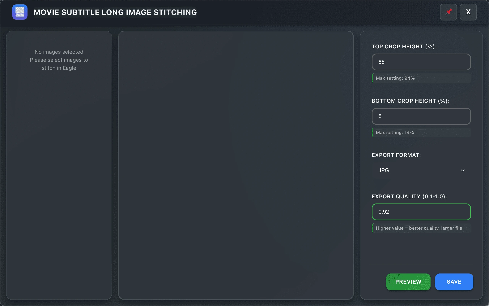
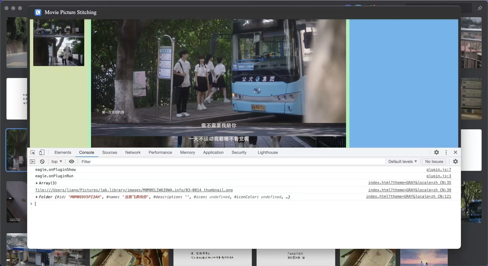
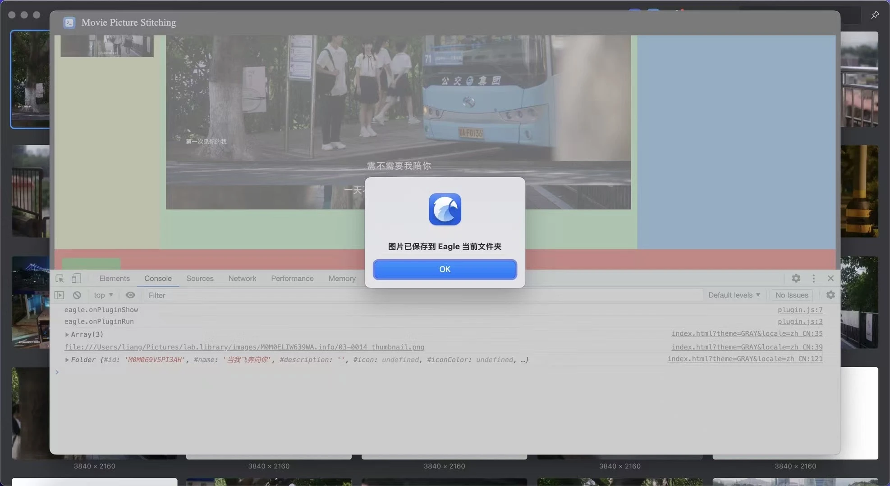
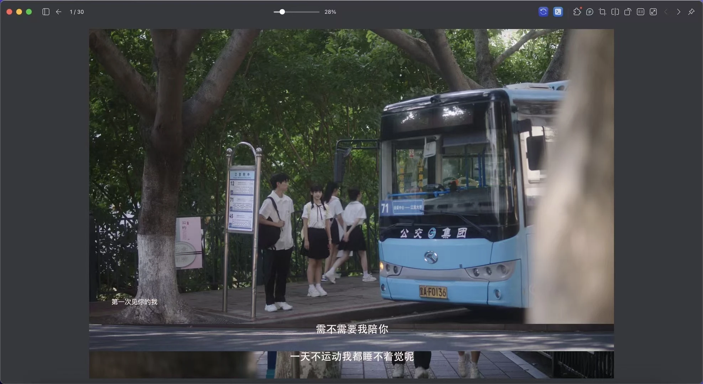

# Changelog

All notable changes to this project will be documented in this file.

The format is based on [Keep a Changelog](https://keepachangelog.com/en/1.0.0/),
and this project adheres to [Semantic Versioning](https://semver.org/spec/v2.0.0.html).

## [Unreleased]

## [1.0.1] - 2025-10-30 💾

### ✨ Added
- 💾 **Parameter Persistence**: Automatically saves and restores user settings
  - Crop percentages (top and bottom)
  - Export format (JPG, PNG, WebP)
  - Export quality (0.1-1.0)
  - Settings persist across plugin sessions using localStorage
  - No manual save/load required - completely automatic
  - Auto-save with 300ms debounce prevents excessive writes
- 🔧 **Storage Manager Module**: New modular storage system with localStorage
  - Robust validation and error handling
  - Graceful degradation when storage unavailable
  - Debug utilities for development (`storageDebug.*` console commands)
  - Namespaced storage keys for data isolation

### 🚀 Improved
- ⚡ **Performance**: Instant plugin load time
  - Fixed critical 5-second delay on plugin open
  - Optimized initialization sequence - DOM operations deferred
  - Plugin now opens instantly (< 200ms)
  - Parameters load and apply synchronously after DOM ready
- 🎯 **User Experience**: Seamless parameter restoration
  - Settings automatically restored on plugin reopen
  - No need to reconfigure parameters every session
  - Smooth, non-blocking initialization
- 🛡️ **Data Safety**: Comprehensive validation before saving/loading parameters
  - Parameter validation prevents invalid values
  - Safe fallback to defaults on load errors

### 🐛 Fixed
- 🔧 Fixed incorrect DOM element IDs causing parameters not to apply
- 🔧 Removed duplicate `getParams()` method definition
- ⚡ Eliminated blocking DOM wait in constructor
- 🚀 Separated initialization logic to prevent UI freeze on plugin open

### 🔧 Technical Changes
- **New Files**:
  - `js/modules/storage-manager.js`: localStorage abstraction layer
- **Modified Files**:
  - `js/modules/parameter-manager.js`: Added storage integration and initialize() method
  - `js/plugin-modular.js`: Updated initialization sequence
  - `index.html`: Added storage-manager.js script
- **New Methods**:
  - `ParameterManager.initialize()`: Apply saved parameters after DOM ready
  - `ParameterManager.applyParametersToDOMSync()`: Synchronous DOM updates
  - `ParameterManager.saveCurrentParameters()`: Debounced auto-save
  - `StorageManager.*`: Complete storage abstraction API
- **Debug Tools**:
  - `storageDebug.viewAll()`: View all saved parameters
  - `storageDebug.clearAll()`: Clear all saved parameters
  - `storageDebug.resetDefaults()`: Reset to default values
  - `storageDebug.testCycle()`: Test save/load cycle

### 📚 Documentation
- Added comprehensive technical documentation
- Created testing guides and troubleshooting steps
- Updated code comments and JSDoc

## [1.0.0] - 2025-09-01 🌍

### ✨ Added
- 🌍 **Complete Internationalization System**: Full 8-language support
  - English, 简体中文, 繁體中文, 日本語, Español, Deutsch, 한국어, Русский
  - Automatic language detection based on Eagle settings
  - Real-time language switching without restart
  - Comprehensive UI element localization
- 🔧 **Enhanced Error Handling**: Multilingual error messages and user feedback
- 📚 **Comprehensive Documentation**: Full English code comments and JSDoc
- 🎯 **Language-Specific Features**: Cultural formatting for numbers and dates
- 🔄 **Dynamic Translation System**: Real-time content translation

### 🚀 Improved  
- 🎨 **UI Accessibility**: Better accessibility and language-specific formatting
- 📱 **Cross-Language UX**: Consistent user experience across all supported languages
- 🔧 **Error Messages**: Localized error handling with culturally appropriate feedback
- 📖 **Code Quality**: Comprehensive English comments replacing Chinese comments
- 🌐 **International Standards**: Adherence to international coding standards

### 🔧 Technical Improvements
- 📁 **File Structure**: Added `_locales/` directory with 8 language files
- 🧩 **Modular Architecture**: Separation of i18n logic from core functionality  
- ⚡ **Performance**: Optimized language switching and translation caching
- 🛡️ **Fallback System**: Graceful fallback to English for missing translations

---

## [0.0.0] - 2024-10 self-use UI backup

---

## Versioning

This project follows [Semantic Versioning](https://semver.org/) guidelines:

- **Major Version**: Incompatible API changes
- **Minor Version**: Backward-compatible functionality additions
- **Patch Version**: Backward-compatible bug fixes

## Release Process

1. Update version number in `manifest.json`
2. Update this CHANGELOG.md file  
3. Create Git tag
4. Build release package
5. Submit to Eagle Plugin Store

## Feedback & Support

If you encounter any issues or have feature suggestions, please reach out:

- **GitHub Issues**: [Issues](https://github.com/leonwong282/eagle-movie-picture-stitching/issues)
- **Feature Requests**: [Discussions](https://github.com/leonwong282/eagle-movie-picture-stitching/discussions)
- **Documentation**: [Wiki](https://github.com/leonwong282/eagle-movie-picture-stitching/wiki)
- **Email**: liangwatcher82@gmail.com

---

**Made with ❤️ for the Eagle community**

*Supporting international users with comprehensive multilingual support*

