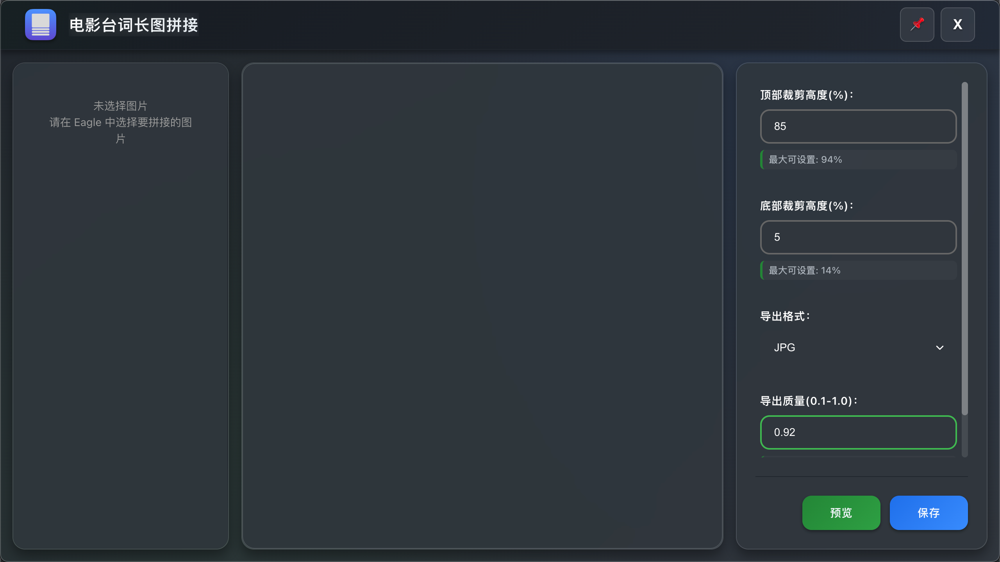
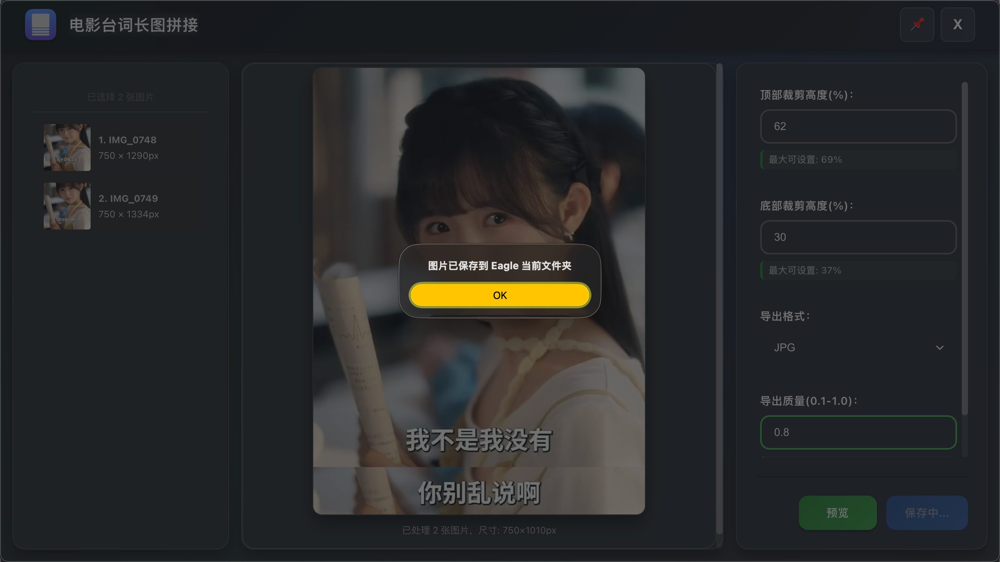

# 更新日志 / Changelog

All notable changes to this project will be documented in this file.

## [1.0.0] - 2025-08-31

### ✨ 新增 / Added
- 🎨 全新现代化UI设计，采用GitHub风格深色主题
- 🪟 玻璃效果背景和精致视觉效果
- 📱 完整的响应式设计支持
- 🎭 流畅的页面加载和交互动画
- 📖 模块化CSS架构，提高代码可维护性
- 🎯 智能参数验证和自动调整
- ⚡ 并行图片加载优化
- 🔄 防抖处理机制
- 📊 实时参数提示和限制显示

### 🚀 改进 / Improved
- 💾 完全重写核心拼接算法，提升处理速度
- 🎛️ 优化参数控制界面，提供更精确的调节
- 🖼️ 增强Canvas渲染性能
- 📁 改进文件保存机制，支持自动命名
- 🎨 提升UI交互体验和视觉效果
- 📱 优化移动端和小屏幕设备适配
- 🔍 改进预览功能的清晰度和响应速度
- 📝 完善错误提示信息，提供解决建议

### 🔧 修复 / Fixed
- 🐛 修复大量图片处理时的内存泄漏问题
- 🎯 修复参数边界值验证错误
- 🖼️ 修复特定格式图片加载失败问题
- 📱 修复小屏幕设备布局异常
- 🎨 修复CSS样式冲突问题
- 📁 修复文件路径处理错误
- 🔄 修复预览更新延迟问题

### 🗑️ 移除 / Removed
- 移除旧版本的jQuery依赖
- 移除不必要的CSS文件
- 移除过时的API调用

### 🔒 安全 / Security
- 加强文件路径验证
- 改进错误处理机制
- 添加输入参数安全检查

## [0.0.1] - 2025-01-15

### ✨ 初始 / Initial
- 🎯 基础图片拼接功能
- ⚙️ 参数调节界面
- 💾 多格式导出支持（JPG, PNG, WebP）
- 🎨 简单的用户界面
- 📝 基础错误处理

---

## 版本号规范 / Versioning

本项目遵循 [语义化版本](https://semver.org/) 规范：

- **主版本号 (Major)**：不兼容的API修改
- **次版本号 (Minor)**：向下兼容的功能性新增
- **修订号 (Patch)**：向下兼容的问题修正

## 发布流程 / Release Process

1. 更新版本号在 `manifest.json`
2. 更新此 CHANGELOG.md 文件
3. 创建 Git 标签
4. 构建发布包
5. 提交到 Eagle 插件商店

## 反馈 / Feedback

如果您发现任何问题或有功能建议，请通过以下方式联系我们：
- GitHub Issues: [Discussions](https://github.com/liangshao07/eagle-movie-picture-stitching/discussions)
- 邮箱: liangwatcher82@gmail.com
