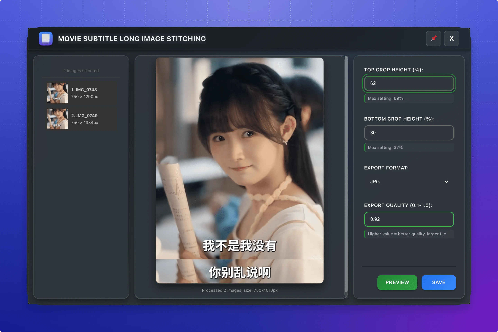
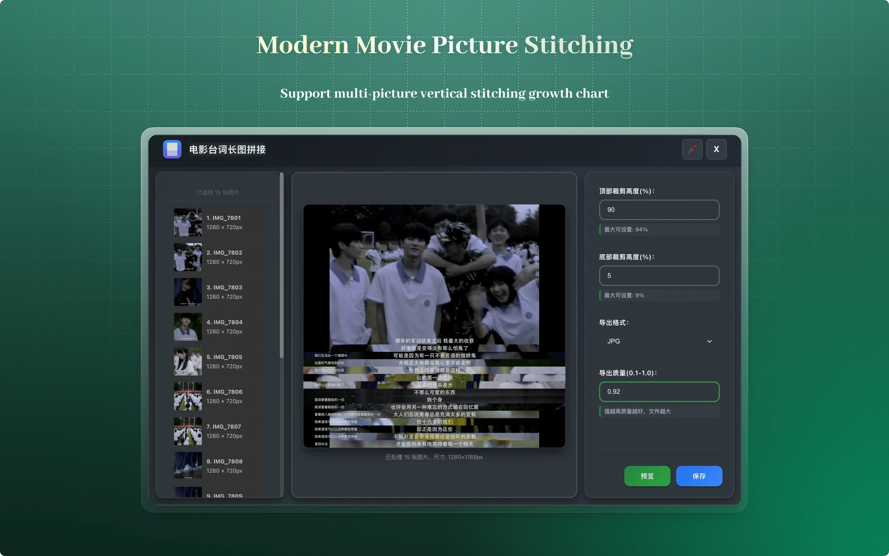
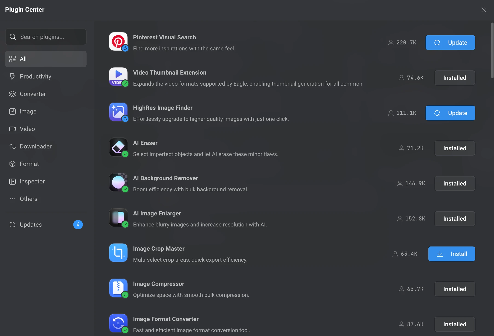
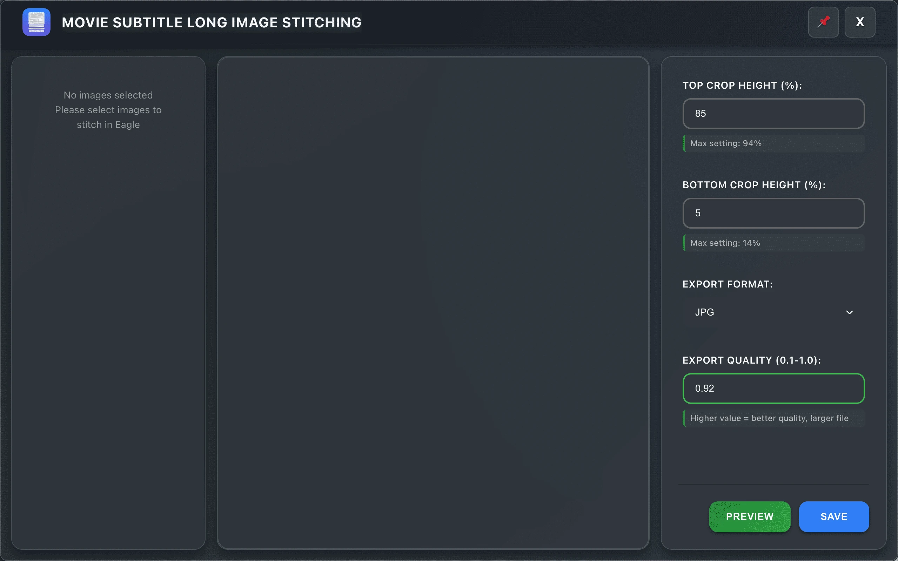
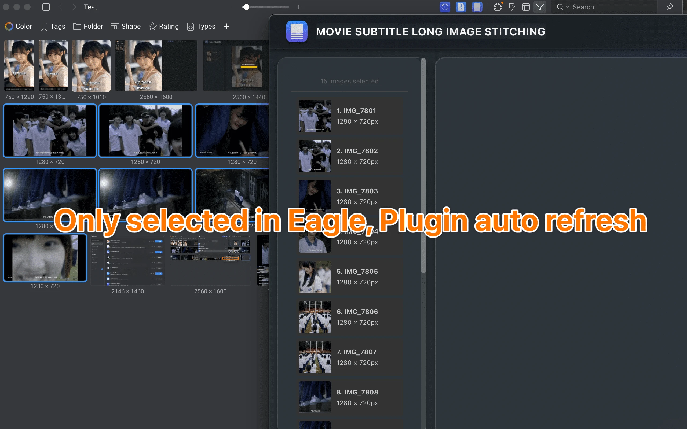
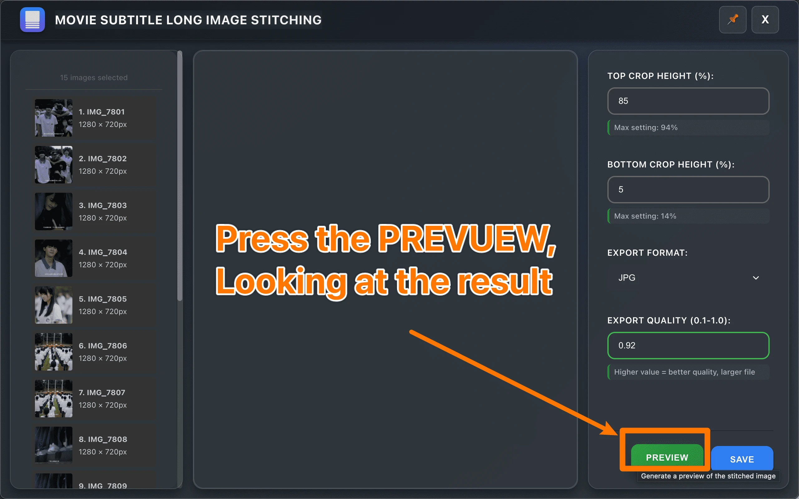
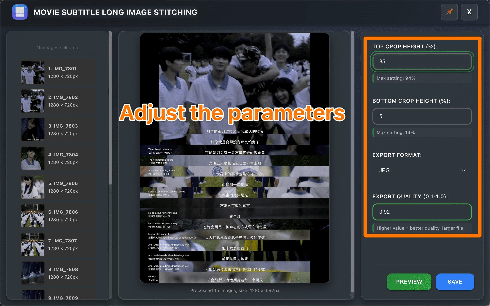
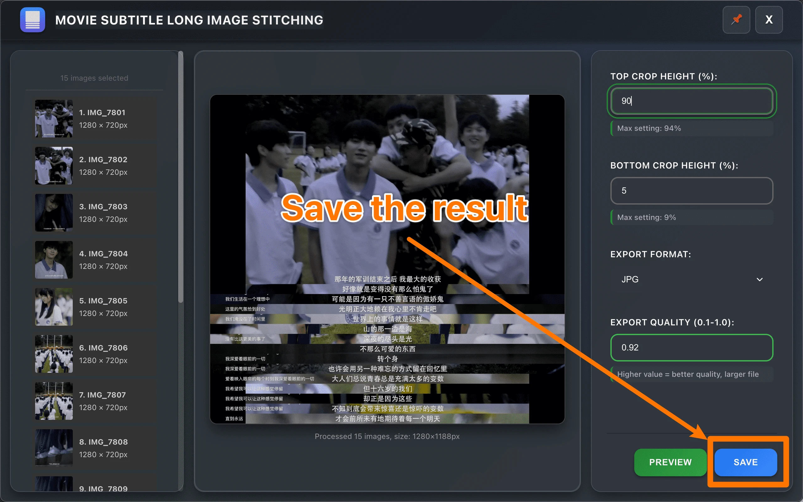
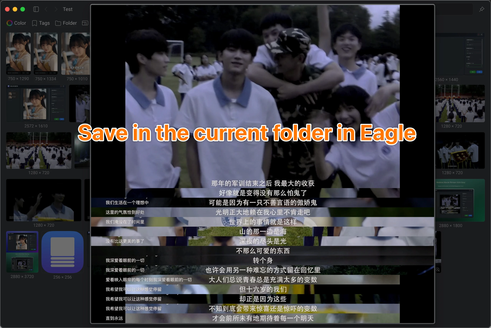
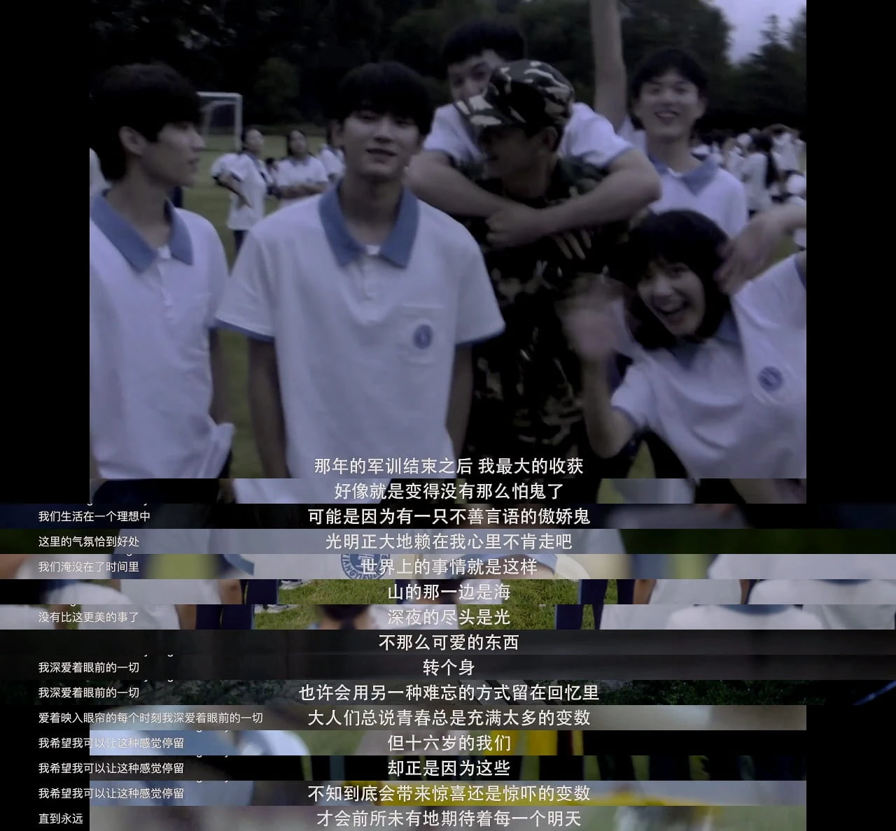

<div align="center">

# 🚀 Movie Picture Stitching - Eagle Plugin

> A modern, internationalized Eagle image management plugin for vertically stitching multiple movie images into panoramic compositions with full multilingual support


**[中文](./README.zh-TW.md)** | **English**


[Features](#-features) • [Installation](#-installation) • [Usage](#-usage) • [Development](#-development)

</div>

<a id="readme-top"></a>

## 📸 Preview





## ✨ Features

### 🎯 Core Functionality

- **Smart Stitching**: Vertically stitch multiple images into panoramic compositions
- **Precise Cropping**: Support top and bottom percentage-based cropping
- **Multi-format Export**: Output in JPG, WebP, PNG formats
- **Quality Control**: 0.1-1.0 precise quality adjustment
- **Real-time Preview**: High-performance Canvas rendering

### 🌍 Internationalization
- **8 Languages**: English, 简体中文, 繁體中文, 日本語, Español, Deutsch, 한국어, Русский
- **Auto Detection**: Automatically detects Eagle's language settings
- **Real-time Switching**: Dynamic language switching without restart
- **Localized Interface**: All UI elements fully translated

### 🎨 Modern Interface
- **Dark Theme**: Eagle-style modern dark interface
- **Glass Effects**: Frosted glass backgrounds and refined visual effects
- **Smooth Animations**: Fluid page loading and interaction animations
- **Responsive Design**: Perfect adaptation to various screen sizes

### 🚀 Advanced Features
- **Parameter Validation**: Smart parameter adjustment preventing invalid inputs
- **Error Handling**: Comprehensive error catching with user-friendly messages
- **Resource Management**: Automatic cleanup of temporary files and memory
- **Performance Optimization**: Parallel image loading with debounced processing
- **Always On Top**: Pin window option for better workflow

## 🛠 Installation

### Method 1: Direct Installation

1. Download the plugin package
2. Open `Settings` → `Plugins` → `Plugins Center` in Eagle
3. Click `Install Plugin`
4. Enable the plugin



### Method 2: Development Installation
1. Download the plugin package
2. Open `Settings` → `Plugins` → `Developer` in Eagle
3. Click `Import Local Project`
4. Select the plugin folder `Movie Picture Stitching`
5. Enable the plugin


## 🎯 Usage

1. **Select Images**: Select 2 or more images in Eagle that you want to stitch together
2. **Open Plugin**: Right-click to open the context menu and click "Movie Picture Stitching"
3. **Configure Parameters**:
   - **Top Crop**: Set the percentage to crop from the top (0-90%)
   - **Bottom Crop**: Set the percentage to crop from the bottom (0-90%)
   - **Quality**: Adjust output quality (0.1-1.0, applies to JPG and WebP formats)
   - **Format**: Choose output format (JPG, WebP, PNG)
4. **Real-time Preview**: The plugin provides real-time preview as you adjust parameters
5. **Save Result**: Click the "Save Image" button to export the stitched image









### 🌍 Language Support

The plugin automatically detects your Eagle language settings and switches to the corresponding interface language. Currently supported languages:

- **English** (en)
- **简体中文** (zh_CN) 
- **繁體中文** (zh_TW)
- **日本語** (ja_JP)
- **Español** (es_ES)
- **Deutsch** (de_DE)
- **한국어** (ko_KR)
- **Русский** (ru_RU)

### 💡 Pro Tips

- **Cropping Guidelines**: Keep total crop percentage (top + bottom) under 80% for best results
- **Quality Balance**: Use 0.8-0.9 quality for optimal file size vs image quality balance
- **Format Selection**: 
  - Use JPG for photos with many colors
  - Use WebP for smaller file sizes with good quality
  - Use PNG for images requiring transparency or lossless compression
- **Performance**: For large images, the plugin automatically optimizes processing for smooth operation

### 📊 Parameter Guide
- **Top Cropping**: Affects all images except the first one, crops specified percentage from top
- **Bottom Cropping**: Affects all images, crops specified percentage from bottom  
- **Export Format**: 
  - `JPG`: Best for photographs with many colors, smaller file size
  - `WebP`: Modern format with excellent compression, balanced quality and size
  - `PNG`: Lossless format, ideal for graphics and images requiring transparency
- **Export Quality**: Range 0.1-1.0, higher values mean better quality but larger files

### 🎯 Usage Tips
- 💡 **Smart Validation**: System automatically displays valid parameter ranges
- 💡 **Cropping Limits**: Total cropping (top + bottom) cannot exceed 99%
- 💡 **Live Preview**: Preview updates in real-time as you adjust parameters
- 💡 **Performance**: Recommended to process maximum 50 images per batch for optimal performance
- 💡 **Memory Management**: Plugin automatically optimizes memory usage for large images

## 🛠️ Development

### Prerequisites
- Eagle 4.0 or higher
- Modern web browser with Canvas API support
- Basic understanding of HTML/CSS/JavaScript

### Project Structure
```
eagle-movie-picture-stitching/
├── LICENSE                                    # GPL-3.0 license
├── README.md                                  # English documentation
├── README_CN.md                               # Chinese documentation
├── CHANGELOG.md                               # Version history
├── Movie Picture Stitching/                  # Plugin main folder
│   ├── Movie Picture Stitching.eagleplugin  # Installable plugin package
│   ├── index.html                           # Main plugin interface
│   ├── manifest.json                        # Plugin configuration and metadata
│   ├── logo.png                             # Plugin icon
│   ├── _locales/                            # Internationalization resources
│   │   ├── en.json                         # English translations
│   │   ├── zh_CN.json                      # Simplified Chinese translations
│   │   ├── zh_TW.json                      # Traditional Chinese translations
│   │   ├── ja_JP.json                      # Japanese translations
│   │   ├── es_ES.json                      # Spanish translations
│   │   ├── de_DE.json                      # German translations
│   │   ├── ko_KR.json                      # Korean translations
│   │   └── ru_RU.json                      # Russian translations
│   ├── css/                                 # Modular stylesheets
│   │   ├── index.css                       # Main stylesheet entry
│   │   └── modules/                        # CSS component modules
│   │       ├── variables.css               # CSS custom properties
│   │       ├── base.css                    # Base styles and resets
│   │       ├── layout.css                  # Layout and grid systems
│   │       ├── components.css              # UI component styles
│   │       ├── buttons.css                 # Button variations
│   │       ├── forms.css                   # Form element styles
│   │       ├── header.css                  # Header component styles
│   │       ├── animations.css              # Transition animations
│   │       ├── responsive.css              # Media queries
│   │       └── scrollbar.css               # Custom scrollbar styles
│   └── js/                                  # JavaScript modules
│       └── plugin.js                       # Core business logic with i18n support
├── image/                                   # Project documentation assets
│   ├── cover.png                           # Project cover image
│   └── feature.png                         # Feature showcase image
└── screenshots/                             # Plugin screenshots
    ├── feature_demo.png                    # Feature demonstration
    ├── main_interface.png                  # Main interface screenshot
    └── result_showcase.png                 # Result showcase
```

### 🌍 Internationalization Development

The plugin features a comprehensive i18n system supporting 8 languages:

**Language Files Structure:**
```
_locales/
├── en.json       # English (base language)
├── zh_CN.json    # Simplified Chinese
├── zh_TW.json    # Traditional Chinese
├── ja_JP.json    # Japanese
├── es_ES.json    # Spanish
├── de_DE.json    # German
├── ko_KR.json    # Korean
└── ru_RU.json    # Russian
```

**Key i18n Features:**
- Automatic language detection based on Eagle settings
- Real-time UI language switching without restart
- Comprehensive error message localization
- Cultural formatting for numbers and dates

### Local Development

1. **Clone Repository**:
   ```bash
   git clone https://github.com/liangshao07/eagle-movie-picture-stitching.git
   cd eagle-movie-picture-stitching
   ```

2. **Development Setup**:
   - Copy the `Movie Picture Stitching` folder to Eagle's plugins directory
   - Enable developer mode in Eagle
   - Restart Eagle to load the plugin

3. **Testing**:
   - Test with various image formats and sizes
   - Verify all 8 language interfaces work correctly
   - Test edge cases (very large images, extreme crop values)
   - Validate performance with different batch sizes

### Core API Reference
```javascript
// Get validated parameters
const params = getParams(adjustingElement);

// Render preview with i18n support
await renderPreview();

// Save image with localized error handling
await saveImage();

// Resource cleanup
cleanup();
```

### 🌍 Internationalization API
```javascript
// Language detection and initialization
i18nManager.init();

// Dynamic translation
i18nManager.translate('key.path');

// Real-time language switching
i18nManager.setLanguage('en');
```

### Tech Stack
- **Frontend**: HTML5, CSS3, Vanilla JavaScript ES6+
- **Design**: CSS Grid, Flexbox, CSS Custom Properties
- **Animations**: CSS Transitions, Keyframe Animations
- **Image Processing**: Canvas API with optimized rendering
- **File Operations**: Node.js fs, path modules
- **Internationalization**: Custom i18n system with 8 languages
- **Architecture**: Modular CSS, Component-based JavaScript

### CSS Architecture
The project uses a modular CSS architecture with CSS variable system:
```css
/* Main variables */
:root {
  --color-bg-primary: #0d1117;
  --color-accent-primary: #238636;
  --border-radius-lg: 12px;
  --spacing-lg: 16px;
  --transition-normal: 0.25s cubic-bezier(0.4, 0, 0.2, 1);
}
```

## 🐛 Troubleshooting

### Common Issues

**Q: Plugin won't start**
- Check if Eagle version supports plugins (requires 4.0+)
- Verify plugin file integrity
- Check error messages in Eagle plugin management page

**Q: Image stitching fails**
- Confirm selected files are valid image formats
- Check if image count is too high (recommend <50 images)
- Verify parameter settings are reasonable

**Q: Preview display issues**
- Refresh plugin page and retry
- Check if image dimensions are too large
- Confirm browser supports Canvas functionality

**Q: Interface display issues**
- Clear browser cache
- Check CSS file integrity
- Confirm browser supports modern CSS features

**Q: Language not switching**
- Verify Eagle language settings match desired language
- Check if language file exists in `_locales/` folder
- Restart plugin to reload language settings

### Performance Optimization Tips
- Keep image count under 50 per batch for optimal performance
- Use JPG format to reduce memory usage
- Avoid processing ultra-high resolution images (>4K)
- Restart plugin periodically to free memory
- Close other resource-intensive applications during large batch processing

### Language Support Issues
- **Missing translations**: Some text may fall back to English if translations are incomplete
- **Cultural formatting**: Numbers and formats automatically adapt to selected language
- **RTL languages**: Currently optimized for LTR languages; RTL support planned for future versions

## 📋 Changelog

### v1.0.0 (2025-09-01) 🌍
- **🌍 Full Internationalization**: Complete 8-language support system
  - English, 简体中文, 繁體中文, 日本語, Español, Deutsch, 한국어, Русский
  - Automatic Eagle language detection
  - Real-time language switching
  - Localized error messages and UI elements
- **🔧 Enhanced Error Handling**: Improved multilingual error messages
- **🎨 UI Improvements**: Better accessibility and language-specific formatting
- **📚 Code Documentation**: Comprehensive English comments and JSDoc

## 📄 License

This project is licensed under the [GPL-3.0 License](LICENSE).

## 🙏 Acknowledgments

- [Eagle](https://eagle.cool/) - Outstanding image management and organization software
- Community contributors for valuable feedback and suggestions
- International users for helping with translations and localization
- All users who support the development of this plugin

## 📞 Contact & Support

- **Project Homepage**: [GitHub Repository](https://github.com/liangshao07/eagle-movie-picture-stitching)
- **Bug Reports**: [Issues](https://github.com/liangshao07/eagle-movie-picture-stitching/issues)
- **Feature Requests**: [Discussions](https://github.com/liangshao07/eagle-movie-picture-stitching/discussions)
- **Documentation**: [Wiki](https://github.com/liangshao07/eagle-movie-picture-stitching/wiki)

---

<div align="center">

**If this plugin helps you, please give it a ⭐ Star!**

Made with ❤️ for the Eagle community

*Supporting Eagle's mission to make digital asset management effortless*

</div>

<p align="right">(<a href="#readme-top">back to top</a>)</p>
