<div align="center">

<a href="https://github.com/leonwong282/awesome-project-template">
  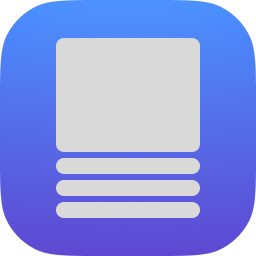
</a>

# 🚀 Movie Picture Stitching - Eagle 插件

> 一款現代化、國際化的 Eagle 影像管理插件，支援將多張電影圖片垂直拼接成全景圖，並具備完整多語言介面


[🌍 English](README.md) | [🇹🇼 繁體中文](README.zh-TW.md) 

[功能特色](#-功能特色) • [安裝方式](#-安裝方式) • [使用說明](#-使用說明) • [開發指南](#-開發指南)

</div>

<a id="readme-top"></a>

## 📸 預覽

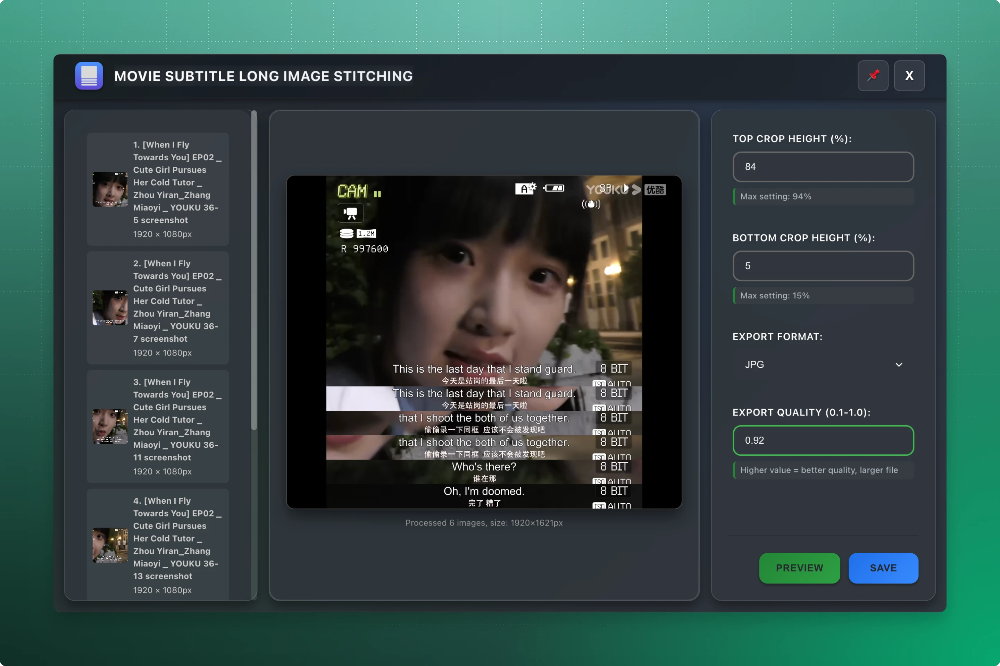
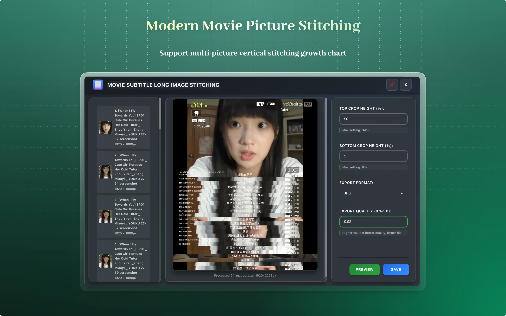

## ✨ 功能特色

### 🎯 核心功能

- **智慧拼接**：多張圖片垂直拼接成全景圖
- **精確裁切**：支援上下百分比裁切
- **多格式匯出**：JPG、WebP、PNG 格式
- **品質控制**：0.1-1.0 精細品質調整
- **即時預覽**：高效能 Canvas 實時預覽

### 🌍 國際化
- **8 種語言**：英文、簡體中文、繁體中文、日文、西班牙文、德文、韓文、俄文
- **自動偵測**：自動偵測 Eagle 語言設定
- **即時切換**：動態語言切換，無需重啟
- **完整翻譯**：所有介面元素皆已本地化

### 🎨 現代化介面
- **深色主題**：Eagle 風格現代深色介面
- **玻璃特效**：毛玻璃背景與精緻視覺效果
- **流暢動畫**：頁面載入與互動動畫
- **響應式設計**：完美適應各種螢幕尺寸

### 🚀 進階功能
- **參數驗證**：智慧參數調整，防止無效輸入
- **錯誤處理**：完整錯誤捕捉，友善提示
- **資源管理**：自動清理暫存檔與記憶體
- **效能優化**：圖片平行載入，防抖處理
- **置頂視窗**：可釘選視窗，提升工作效率

## 🛠 安裝方式

### 方法一：直接安裝

1. 下載插件安裝包
2. 開啟 Eagle 的「設定」→「插件」→「插件中心」
3. 點擊「安裝插件」
4. 啟用插件

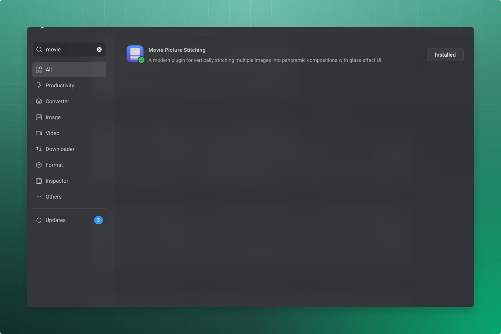

### 方法二：開發者安裝
1. 下載插件安裝包
2. 開啟 Eagle 的「設定」→「插件」→「開發者」
3. 點擊「匯入本地專案」
4. 選擇插件資料夾 `Movie Picture Stitching`
5. 啟用插件

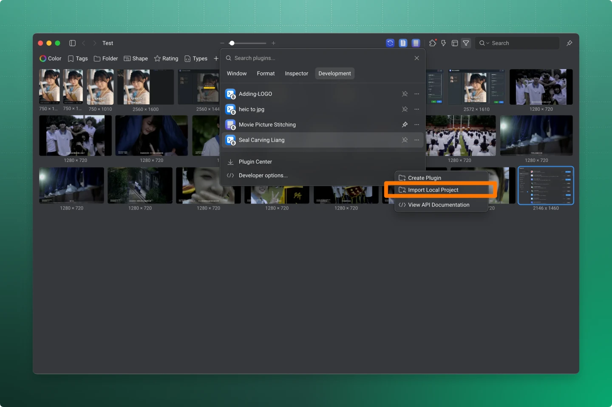

## 🎯 使用說明

1. **選擇圖片**：在 Eagle 中選取 2 張以上欲拼接的圖片
2. **開啟插件**：右鍵選單點擊「Movie Picture Stitching」
3. **設定參數**：
   - **上裁切**：設定從頂部裁切的百分比 (0-90%)
   - **下裁切**：設定從底部裁切的百分比 (0-90%)
   - **品質**：調整匯出品質 (0.1-1.0，適用於 JPG 與 WebP)
   - **格式**：選擇匯出格式 (JPG、WebP、PNG)
4. **即時預覽**：調整參數時即時預覽拼接效果
5. **儲存結果**：點擊「儲存圖片」匯出拼接後圖片


### 🌍 語言支援

插件會自動偵測 Eagle 語言設定並切換介面，目前支援以下語言：

- **英文** (en)
- **簡體中文** (zh_CN) 
- **繁體中文** (zh_TW)
- **日文** (ja_JP)
- **西班牙文** (es_ES)
- **德文** (de_DE)
- **韓文** (ko_KR)
- **俄文** (ru_RU)

### 💡 使用小技巧

- **裁切建議**：總裁切百分比（上+下）建議不超過 80% 以獲得最佳效果
- **品質平衡**：建議品質設為 0.8-0.9，兼顧檔案大小與畫質
- **格式選擇**：
  - JPG：適合色彩豐富的照片
  - WebP：檔案小且品質佳
  - PNG：需透明或無損壓縮時使用
- **效能提示**：大圖自動優化處理，確保流暢操作

### 📊 參數指南
- **上裁切**：影響除第一張外所有圖片，從頂部裁切指定百分比
- **下裁切**：影響所有圖片，從底部裁切指定百分比  
- **匯出格式**：
  - `JPG`：適合色彩豐富的照片，檔案較小
  - `WebP`：現代格式，壓縮佳，品質與檔案大小平衡
  - `PNG`：無損格式，適合需透明的圖片
- **匯出品質**：範圍 0.1-1.0，值越高畫質越好但檔案越大

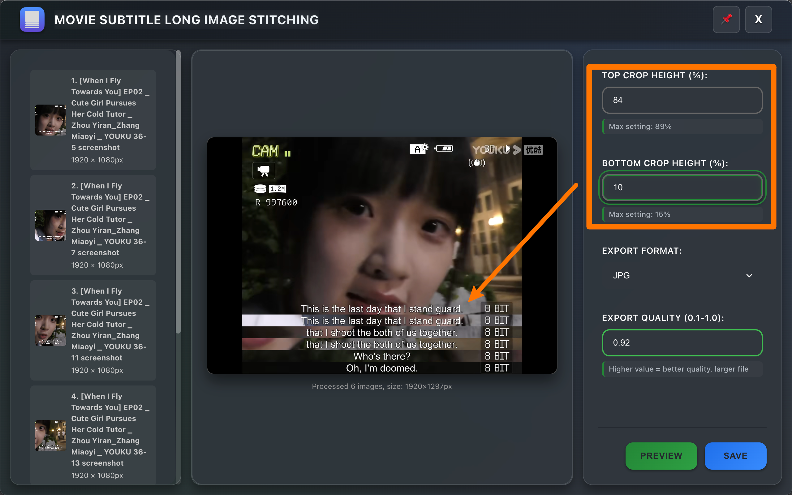
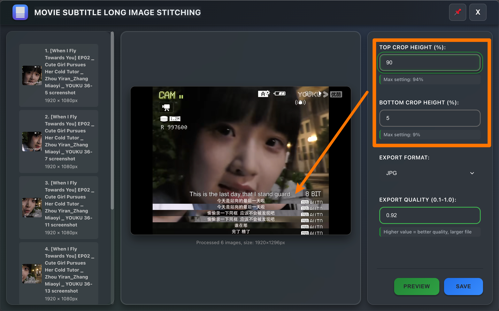
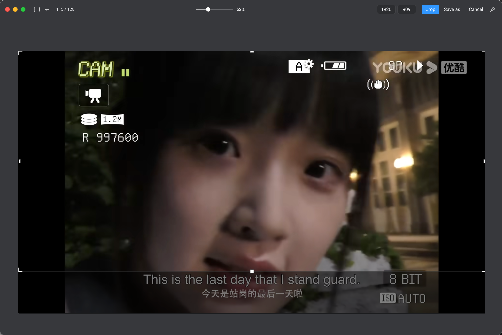
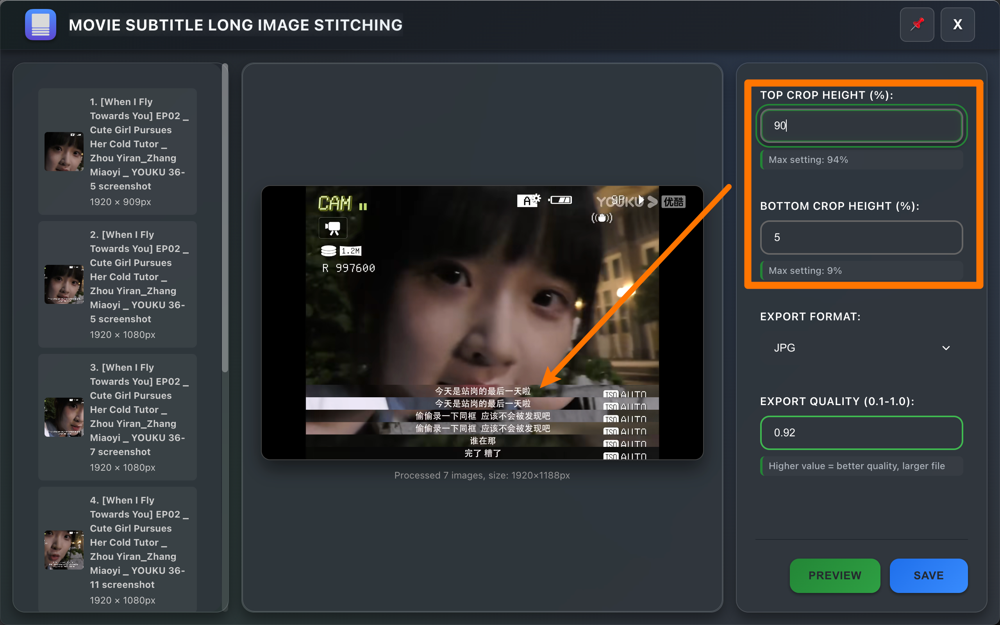

### 🎯 使用提示
- 💡 **智慧驗證**：系統自動顯示有效參數範圍
- 💡 **裁切限制**：總裁切（上+下）不可超過 99%
- 💡 **即時預覽**：調整參數時即時更新預覽
- 💡 **效能建議**：建議每批最多處理 50 張圖片
- 💡 **記憶體管理**：大圖自動優化記憶體使用

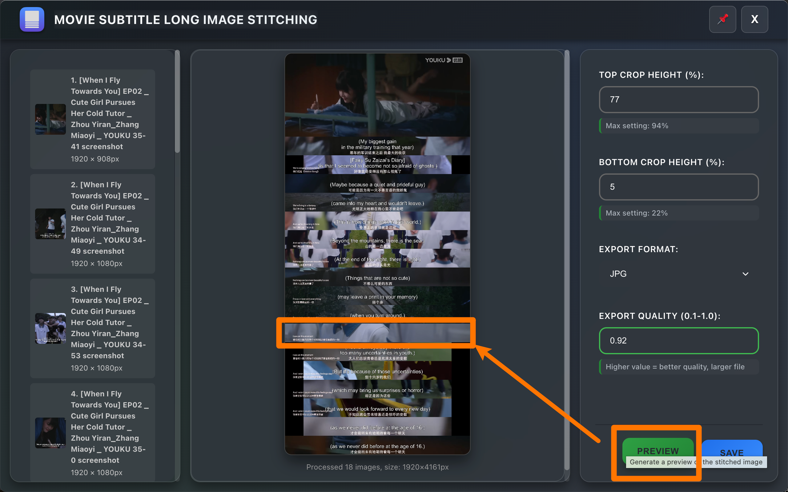
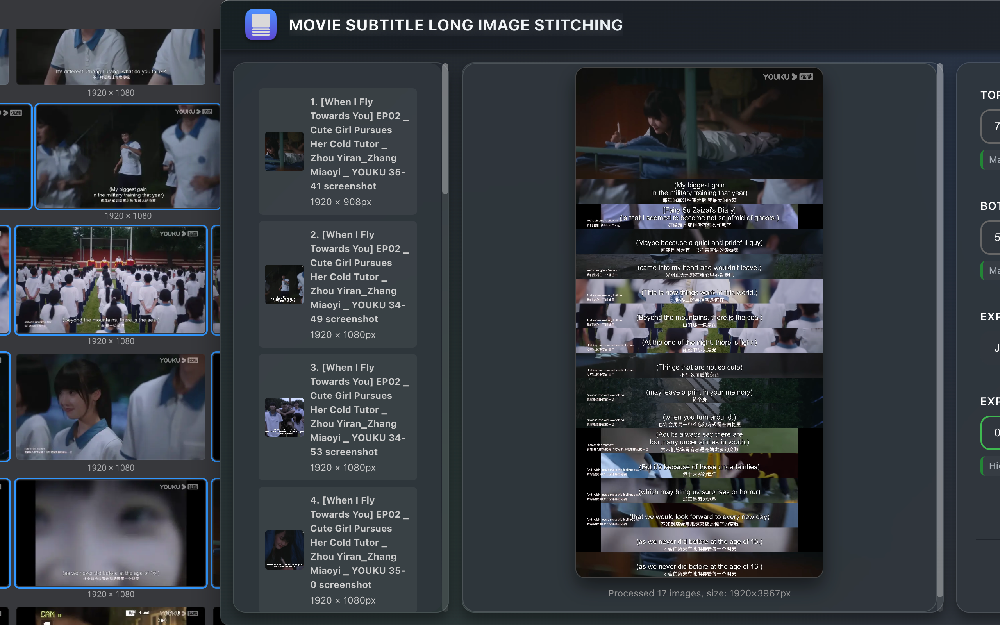

## 🛠️ 開發指南

### 環境需求
- Eagle 4.0 以上
- 支援 Canvas API 的現代瀏覽器
- 基本 HTML/CSS/JavaScript 知識

### 專案結構
```
eagle-movie-picture-stitching/
├── LICENSE                                    # GPL-3.0 授權
├── README.md                                  # 英文說明文件
├── README_CN.md                               # 中文說明文件
├── CHANGELOG.md                               # 版本歷史
├── Movie Picture Stitching/                  # 插件主資料夾
│   ├── Movie Picture Stitching.eagleplugin  # 可安裝插件包
│   ├── index.html                           # 主介面
│   ├── manifest.json                        # 插件設定與資訊
│   ├── logo.png                             # 插件圖示
│   ├── _locales/                            # 國際化資源
│   │   ├── en.json                         # 英文翻譯
│   │   ├── zh_CN.json                      # 簡體中文翻譯
│   │   ├── zh_TW.json                      # 繁體中文翻譯
│   │   ├── ja_JP.json                      # 日文翻譯
│   │   ├── es_ES.json                      # 西班牙文翻譯
│   │   ├── de_DE.json                      # 德文翻譯
│   │   ├── ko_KR.json                      # 韓文翻譯
│   │   └── ru_RU.json                      # 俄文翻譯
│   ├── css/                                 # 模組化樣式
│   │   ├── index.css                       # 樣式入口
│   │   └── modules/                        # CSS 元件模組
│   │       ├── variables.css               # CSS 變數
│   │       ├── base.css                    # 基礎樣式
│   │       ├── layout.css                  # 版面配置
│   │       ├── components.css              # UI 元件
│   │       ├── buttons.css                 # 按鈕樣式
│   │       ├── forms.css                   # 表單樣式
│   │       ├── header.css                  # 標頭樣式
│   │       ├── animations.css              # 動畫
│   │       ├── responsive.css              # 響應式
│   │       └── scrollbar.css               # 自訂捲軸
│   └── js/                                  # JavaScript 模組
│       └── plugin.js                       # 核心邏輯與 i18n 支援
├── image/                                   # 文件資源
│   ├── cover.png                           # 封面
│   └── feature.png                         # 功能展示
└── screenshots/                             # 插件截圖
    ├── feature_demo.png                    # 功能演示
    ├── main_interface.png                  # 主介面
    └── result_showcase.png                 # 結果展示
```

### 🌍 國際化開發

插件支援 8 種語言，並具備完整 i18n 系統：

**語言檔案結構：**
```
_locales/
├── en.json       # 英文 (基礎語言)
├── zh_CN.json    # 簡體中文
├── zh_TW.json    # 繁體中文
├── ja_JP.json    # 日文
├── es_ES.json    # 西班牙文
├── de_DE.json    # 德文
├── ko_KR.json    # 韓文
└── ru_RU.json    # 俄文
```

**主要 i18n 功能：**
- 根據 Eagle 設定自動偵測語言
- 即時切換 UI 語言，無需重啟
- 完整錯誤訊息本地化
- 文化化數字與日期格式

### 本地開發

1. **複製專案**：
   ```bash
   git clone https://github.com/leonwong282/eagle-movie-picture-stitching.git
   cd eagle-movie-picture-stitching
   ```

2. **開發環境設置**：
   - 將 `Movie Picture Stitching` 資料夾複製到 Eagle 插件目錄
   - 啟用 Eagle 開發者模式
   - 重新啟動 Eagle 載入插件

3. **測試**：
   - 測試各種圖片格式與尺寸
   - 驗證 8 種語言介面
   - 測試極端情境（大圖、極端裁切值）
   - 驗證不同批次效能

### 核心 API 參考
```javascript
// 取得驗證後參數
const params = getParams(adjustingElement);

// 使用 i18n 支援渲染預覽
await renderPreview();

// 儲存圖片並本地化錯誤處理
await saveImage();

// 資源清理
cleanup();
```

### 🌍 國際化 API
```javascript
// 語言偵測與初始化
i18nManager.init();

// 動態翻譯
i18nManager.translate('key.path');

// 即時語言切換
i18nManager.setLanguage('zh_TW');
```

### 技術棧
- **前端**：HTML5、CSS3、Vanilla JavaScript ES6+
- **設計**：CSS Grid、Flexbox、CSS 變數
- **動畫**：CSS 過渡、關鍵影格動畫
- **圖片處理**：Canvas API 高效渲染
- **檔案操作**：Node.js fs、path 模組
- **國際化**：自訂 i18n 系統，支援 8 種語言
- **架構**：模組化 CSS、元件式 JavaScript

### CSS 架構
本專案採用模組化 CSS 架構與 CSS 變數系統：
```css
/* 主要變數 */
:root {
  --color-bg-primary: #0d1117;
  --color-accent-primary: #238636;
  --border-radius-lg: 12px;
  --spacing-lg: 16px;
  --transition-normal: 0.25s cubic-bezier(0.4, 0, 0.2, 1);
}
```

## 🐛 疑難排解

### 常見問題

**Q: 插件無法啟動**
- 請確認 Eagle 版本支援插件（需 4.0 以上）
- 檢查插件檔案完整性
- 查看 Eagle 插件管理頁錯誤訊息

**Q: 圖片拼接失敗**
- 確認選取的檔案為有效圖片格式
- 檢查圖片數量是否過多（建議 <50 張）
- 驗證參數設定是否合理

**Q: 預覽顯示異常**
- 重新整理插件頁面
- 檢查圖片尺寸是否過大
- 確認瀏覽器支援 Canvas 功能

**Q: 介面顯示異常**
- 清除瀏覽器快取
- 檢查 CSS 檔案完整性
- 確認瀏覽器支援現代 CSS

**Q: 語言無法切換**
- 確認 Eagle 語言設定
- 檢查 `_locales/` 資料夾是否有語言檔
- 重新啟動插件

### 效能優化建議
- 每批圖片建議不超過 50 張
- 使用 JPG 格式降低記憶體消耗
- 避免處理超高解析度圖片（>4K）
- 定期重啟插件釋放記憶體
- 處理大量圖片時關閉其他高資源程式

### 語言支援問題
- **缺少翻譯**：部分文字若翻譯不完整會回退英文
- **文化化格式**：數字與格式會自動依語言調整
- **RTL 語言**：目前優化 LTR 語言，RTL 支援未來規劃

## 📋 更新紀錄

### v1.0.0 (2025-09-01) 🌍
- **🌍 完整國際化**：支援 8 種語言
  - 英文、簡體中文、繁體中文、日文、西班牙文、德文、韓文、俄文
  - 自動偵測 Eagle 語言
  - 即時語言切換
  - 本地化錯誤訊息與介面
- **🔧 強化錯誤處理**：多語言錯誤提示
- **🎨 UI 改善**：提升無障礙與語言格式化
- **📚 程式註解**：完整英文註解與 JSDoc

## 📄 授權

本專案採用 [GPL-3.0 License](LICENSE) 授權。

## 🙏 致謝

- [Eagle](https://eagle.cool/) - 優秀的影像管理軟體
- 社群貢獻者的寶貴建議
- 國際用戶協助翻譯與本地化
- 所有支持本插件的用戶

## 📞 聯絡與支援

- **專案首頁**：[GitHub Repository](https://github.com/leonwong282/eagle-movie-picture-stitching)
- **問題回報**：[Issues](https://github.com/leonwong282/eagle-movie-picture-stitching/issues)
- **功能建議**：[Discussions](https://github.com/leonwong282/eagle-movie-picture-stitching/discussions)
- **文件說明**：[Wiki](https://github.com/leonwong282/eagle-movie-picture-stitching/wiki)

---

<div align="center">

**如果本插件對你有幫助，請給予 ⭐ Star 支持！**

Made with ❤️ for the Eagle community

*致力於讓數位資產管理更輕鬆*

</div>

<p align="right">(<a href="#readme-top">回到頂部</a>)</p>
