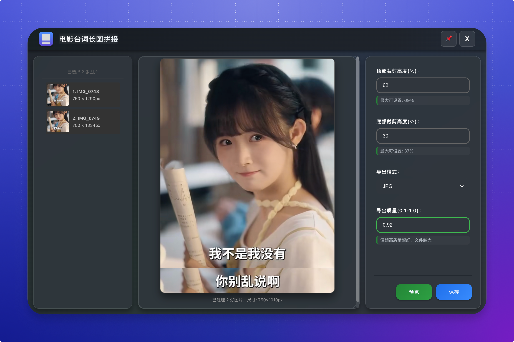
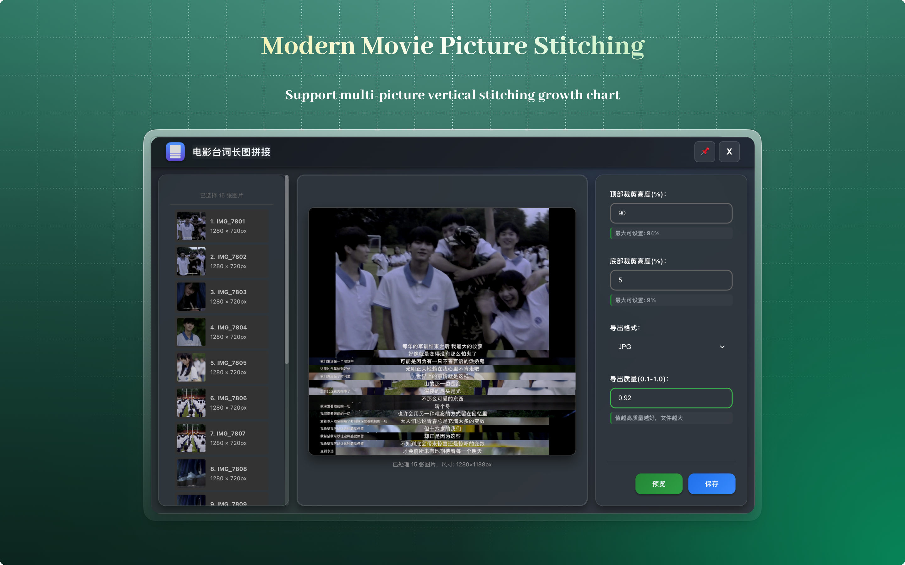
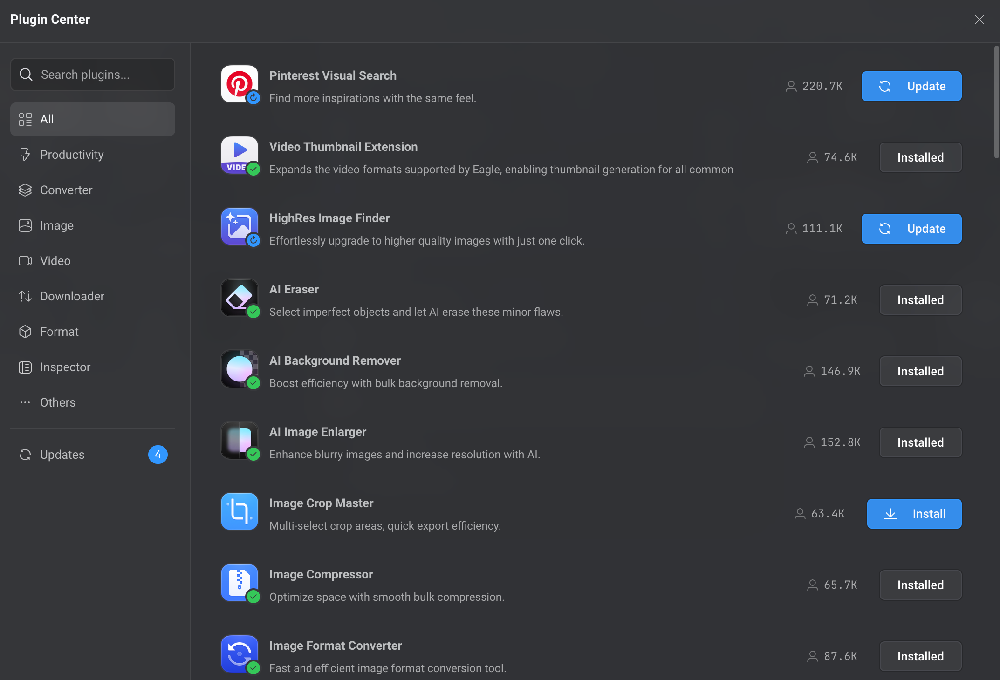
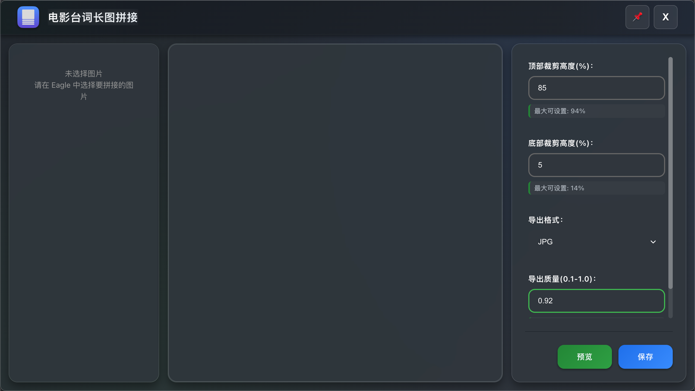
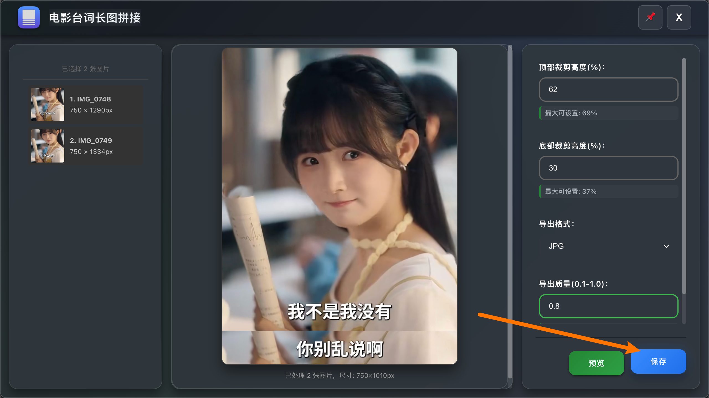
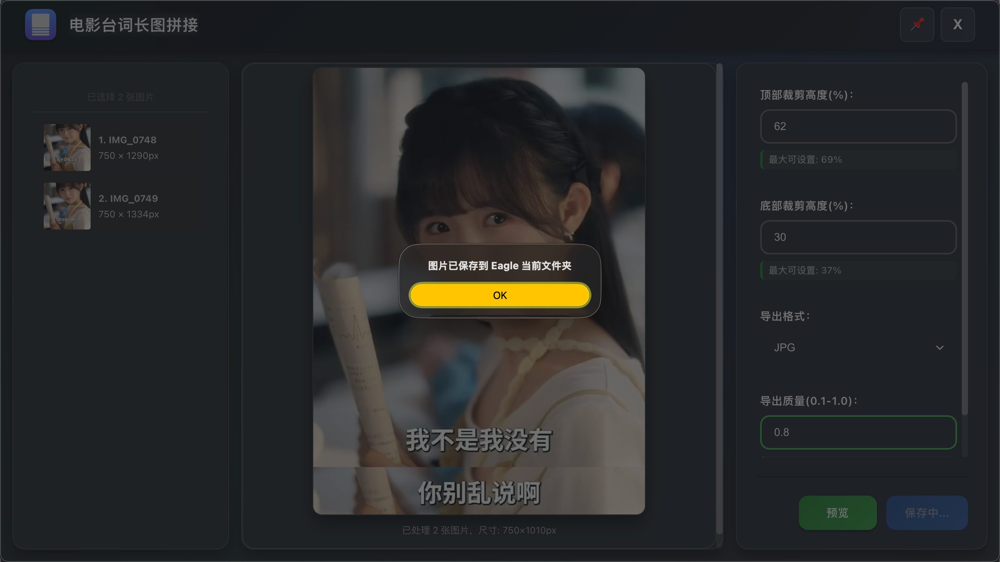

# Movie Picture Stitching - Eagle Plugin

<div align="center">


**[English](./README.md)** | **中文**

一个现代化、国际化的Eagle图片管理软件插件，支持多语言界面和高级参数控制的垂直图片拼接功能

[功能特性](#-功能特性) • [安装说明](#-安装说明) • [使用方法](#-使用方法) • [开发文档](#-开发文档)

</div>

## 📸 预览




## ✨ 功能特性

### 🎯 核心功能

- **智能拼接**: 将多张图片垂直拼接成一张长图
- **精确裁剪**: 支持顶部和底部精确百分比裁剪
- **多格式支持**: 输出JPG、WebP、PNG格式
- **质量控制**: 0.1-1.0精确质量调节
- **实时预览**: Canvas直接渲染，高性能预览

### � 国际化支持
- **8种语言**: English, 简体中文, 繁體中文, 日本語, Español, Deutsch, 한국어, Русский
- **自动检测**: 自动检测Eagle的语言设置并切换界面语言
- **实时切换**: 支持动态语言切换，无需重启
- **本地化界面**: 所有UI元素完全翻译

### �🎨 现代化界面
- **深色主题**: Eagle风格的现代深色界面
- **玻璃效果**: 毛玻璃背景和精致视觉效果
- **流畅动画**: 页面加载和交互的流畅动画
- **响应式设计**: 完美适配各种屏幕尺寸

### 🚀 高级特性
- **参数验证**: 智能参数调整，防止无效输入
- **错误处理**: 完善的错误捕获和用户友好提示
- **资源管理**: 自动清理临时文件和内存
- **性能优化**: 并行图片加载，防抖处理
- **窗口置顶**: 支持窗口置顶功能，提升工作流效率


## 🛠 安装说明

### 方式一：直接安装

1. 下载插件文件包
2. 在Eagle中打开 `设置` → `插件` → `插件中心`
3. 点击 `安装插件`
4. 启用插件




### 方式二：开发安装
1. 在Eagle中打开 `设置` → `插件` → `开发者选项`
3. 点击 `安装本地插件`
4. 启用插件


## � 使用方法

1. **选择图片**: 在Eagle中选择2张或更多要拼接的图片
2. **打开插件**: 右键打开上下文菜单，点击"Movie Picture Stitching"
3. **配置参数**:
   - **顶部裁剪**: 设置从顶部裁剪的百分比 (0-90%)
   - **底部裁剪**: 设置从底部裁剪的百分比 (0-90%)
   - **质量**: 调整输出质量 (0.1-1.0，适用于JPG和WebP格式)
   - **格式**: 选择输出格式 (JPG, WebP, PNG)
4. **实时预览**: 插件提供参数调整的实时预览
5. **保存结果**: 点击"保存图片"按钮导出拼接结果

### 🌍 语言支持

插件会自动检测您的Eagle语言设置并切换到对应的界面语言。目前支持的语言：

- **English** (en)
- **简体中文** (zh_CN) 
- **繁體中文** (zh_TW)
- **日本語** (ja_JP)
- **Español** (es_ES)
- **Deutsch** (de_DE)
- **한국어** (ko_KR)
- **Русский** (ru_RU)

### 💡 使用技巧

- **裁剪指南**: 保持总裁剪百分比（顶部+底部）在80%以下以获得最佳效果
- **质量平衡**: 使用0.8-0.9质量设置获得最佳文件大小与图片质量平衡
- **格式选择**: 
  - 使用JPG处理色彩丰富的照片
  - 使用WebP获得更小的文件大小和良好质量
  - 使用PNG处理需要透明度或无损压缩的图片
- **性能**: 对于大图片，插件会自动优化处理以确保流畅操作





### 📊 参数指南
- **顶部裁剪**: 除第一张图片外的所有图片，从顶部裁剪指定百分比
- **底部裁剪**: 对所有图片生效，从底部裁剪指定百分比  
- **导出格式**: 
  - `JPG`: 最适合色彩丰富的照片，文件更小
  - `WebP`: 现代格式，具有出色的压缩性能，质量与大小平衡
  - `PNG`: 无损格式，适合图形和需要透明度的图片
- **导出质量**: 范围0.1-1.0，值越高质量越好但文件越大

### 🎯 使用技巧
- 💡 **智能验证**: 系统自动显示有效的参数范围
- 💡 **裁剪限制**: 总裁剪量（顶部+底部）不能超过99%
- 💡 **实时预览**: 调整参数时预览会实时更新
- 💡 **性能**: 建议每批次最多处理50张图片以获得最佳性能
- 💡 **内存管理**: 插件自动优化大图片的内存使用

## �️ 开发文档

### 前提条件
- Eagle 4.0 或更高版本
- 支持Canvas API的现代浏览器
- 基础的HTML/CSS/JavaScript知识

### 项目结构
```
eagle-movie-picture-stitching/
├── LICENSE                                    # GPL-3.0 许可证
├── README.md                                  # 英文文档
├── README_CN.md                               # 中文文档
├── CHANGELOG.md                               # 版本历史
├── Movie Picture Stitching/                  # 插件主文件夹
│   ├── Movie Picture Stitching.eagleplugin  # 可安装的插件包
│   ├── index.html                           # 主界面文件
│   ├── manifest.json                        # 插件配置和元数据
│   ├── logo.png                             # 插件图标
│   ├── _locales/                            # 国际化资源
│   │   ├── en.json                         # 英文翻译
│   │   ├── zh_CN.json                      # 简体中文翻译
│   │   ├── zh_TW.json                      # 繁体中文翻译
│   │   ├── ja_JP.json                      # 日语翻译
│   │   ├── es_ES.json                      # 西班牙语翻译
│   │   ├── de_DE.json                      # 德语翻译
│   │   ├── ko_KR.json                      # 韩语翻译
│   │   └── ru_RU.json                      # 俄语翻译
│   ├── css/                                 # 模块化样式表
│   │   ├── index.css                       # 主样式入口
│   │   └── modules/                        # CSS组件模块
│   │       ├── variables.css               # CSS自定义属性
│   │       ├── base.css                    # 基础样式和重置
│   │       ├── layout.css                  # 布局和网格系统
│   │       ├── components.css              # UI组件样式
│   │       ├── buttons.css                 # 按钮变体
│   │       ├── forms.css                   # 表单元素样式
│   │       ├── header.css                  # 头部组件样式
│   │       ├── animations.css              # 过渡动画
│   │       ├── responsive.css              # 媒体查询
│   │       └── scrollbar.css               # 自定义滚动条样式
│   └── js/                                  # JavaScript模块
│       └── plugin.js                       # 核心业务逻辑（带i18n支持）
├── image/                                   # 项目文档资源
│   ├── cover.png                           # 项目封面图
│   └── feature.png                         # 功能展示图
└── screenshots/                             # 插件截图
    ├── feature_demo.png                    # 功能演示
    ├── main_interface.png                  # 主界面截图
    └── result_showcase.png                 # 结果展示
```

### 🌍 国际化开发

插件具有支持8种语言的综合i18n系统：

**语言文件结构：**
```
_locales/
├── en.json       # 英语（基础语言）
├── zh_CN.json    # 简体中文
├── zh_TW.json    # 繁体中文
├── ja_JP.json    # 日语
├── es_ES.json    # 西班牙语
├── de_DE.json    # 德语
├── ko_KR.json    # 韩语
└── ru_RU.json    # 俄语
```

**关键i18n特性：**
- 基于Eagle设置的自动语言检测
- 无需重启的实时UI语言切换
- 全面的错误消息本地化
- 数字和日期的文化格式化

### 本地开发

1. **克隆仓库**:
   ```bash
   git clone https://github.com/liangshao07/eagle-movie-picture-stitching.git
   cd eagle-movie-picture-stitching
   ```

2. **开发设置**:
   - 将 `Movie Picture Stitching` 文件夹复制到Eagle的插件目录
   - 在Eagle中启用开发者模式
   - 重启Eagle以加载插件

3. **测试**:
   - 测试各种图片格式和尺寸
   - 验证所有8种语言界面工作正常
   - 测试边界情况（超大图片、极端裁剪值）
   - 验证不同批次大小的性能

### 核心API参考
```javascript
// 获取验证过的参数
const params = getParams(adjustingElement);

// 渲染预览（带i18n支持）
await renderPreview();

// 保存图片（带本地化错误处理）
await saveImage();

// 资源清理
cleanup();
```

### 🌍 国际化API
```javascript
// 语言检测和初始化
i18nManager.init();

// 动态翻译
i18nManager.translate('key.path');

// 实时语言切换
i18nManager.setLanguage('zh_CN');
```

### 技术栈
- **前端**: HTML5, CSS3, Vanilla JavaScript ES6+
- **设计**: CSS Grid, Flexbox, CSS自定义属性
- **动画**: CSS过渡, 关键帧动画
- **图像处理**: Canvas API优化渲染
- **文件操作**: Node.js fs, path模块
- **国际化**: 8语言自定义i18n系统
- **架构**: 模块化CSS, 组件化JavaScript

### CSS架构
项目采用模块化CSS架构和CSS变量系统：
```css
/* 主要变量 */
:root {
  --color-bg-primary: #0d1117;
  --color-accent-primary: #238636;
  --border-radius-lg: 12px;
  --spacing-lg: 16px;
  --transition-normal: 0.25s cubic-bezier(0.4, 0, 0.2, 1);
}
```

## 🐛 故障排除

### 常见问题

**Q: 插件无法启动**
- 检查Eagle版本是否支持插件（需要 4.0+）
- 验证插件文件完整性
- 查看Eagle插件管理页面的错误信息

**Q: 图片拼接失败**
- 确认选择的文件是有效的图片格式
- 检查图片数量是否过多（建议<50张）
- 验证参数设置是否合理

**Q: 预览显示问题**
- 刷新插件页面并重试
- 检查图片尺寸是否过大
- 确认浏览器支持Canvas功能

**Q: 界面显示问题**
- 清除浏览器缓存
- 检查CSS文件完整性
- 确认浏览器支持现代CSS特性

**Q: 语言未切换**
- 验证Eagle语言设置与期望语言匹配
- 检查 `_locales/` 文件夹中是否存在语言文件
- 重启插件以重新加载语言设置

### 性能优化建议
- 保持每批次图片数量在50张以下以获得最佳性能
- 使用JPG格式减少内存使用
- 避免处理超高分辨率图片（>4K）
- 定期重启插件释放内存
- 大批量处理期间关闭其他资源密集型应用

## 📋 更新日志

### v1.1.0 (2025-09-01) 🌍
- **🌍 完整国际化**: 完整的8语言支持系统
  - English, 简体中文, 繁體中文, 日本語, Español, Deutsch, 한국어, Русский
  - 自动Eagle语言检测
  - 实时语言切换
  - 本地化错误信息和UI元素
- **🔧 增强错误处理**: 改进的多语言错误信息
- **🎨 UI改进**: 更好的可访问性和语言特定格式
- **📚 代码文档**: 全面的英文注释和JSDoc

### v1.0.0 (2025-08-31)
- 🎨 全新现代UI设计
- 🚀 核心功能完全重写
- 📱 新增响应式设计支持
- ✨ 新的玻璃效果和动画
- 🔧 优化性能和错误处理
- 📖 模块化CSS架构

### v0.0.1 (初始版本)
- 🎯 基础图片拼接功能
- ⚙️ 参数调整界面
- 💾 多格式导出支持

## 📄 许可证

本项目采用 [GPL-3.0 许可证](LICENSE)。

## 🙏 致谢

- [Eagle](https://eagle.cool/) - 卓越的图片管理和整理软件
- 社区贡献者提供的宝贵反馈和建议
- 国际用户帮助进行翻译和本地化
- 所有支持本插件开发的用户

## 📞 联系与支持

- **项目主页**: [GitHub Repository](https://github.com/liangshao07/eagle-movie-picture-stitching)
- **Bug报告**: [Issues](https://github.com/liangshao07/eagle-movie-picture-stitching/issues)
- **功能请求**: [Discussions](https://github.com/liangshao07/eagle-movie-picture-stitching/discussions)
- **文档**: [Wiki](https://github.com/liangshao07/eagle-movie-picture-stitching/wiki)

---

<div align="center">

**如果这个插件对您有帮助，请给它一个 ⭐ Star！**

为Eagle社区用心制作 ❤️

*支持Eagle让数字资产管理变得轻松的使命*

</div>

